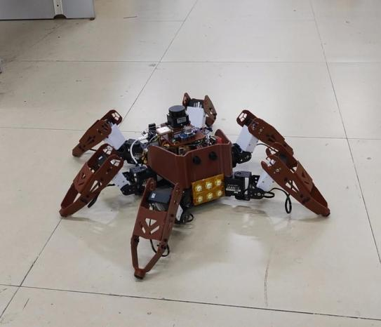
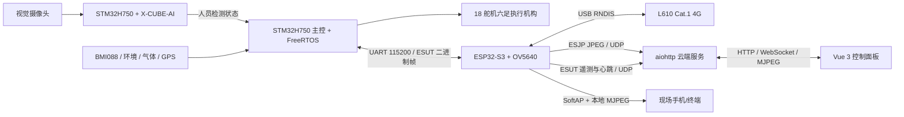

# 基于 STM32H750 的 AI 视觉六足救援机器人

面向建筑坍塌、地下管廊、矿井和危险巡检场景的六足机器人原型。仓库包含 STM32H750 AI 视觉工程、六足主控工程，以及通信 V7.3 的 ESP32-S3 固件、aiohttp 服务端和 Vue 3 前端。



> 完整设计、硬件、软件和样机成果见 [《基于 STM32H750 的 AI 视觉六足救援机器人技术文档》](docs/基于STM32H750的AI视觉六足救援机器人技术文档.pdf)。通信 V7.3 的详细说明见 [communication/README.md](communication/README.md) 和 [CHANGELOG_V7_3.md](CHANGELOG_V7_3.md)。

## 当前系统架构



通信 V7.3 使用固定在机身上的 OV5640 视角，不提供独立云台控制。ESP32-S3 通过 L610 RNDIS 维持云端视频、遥测和控制链路，同时支持 AP 本地 MJPEG、4G 管理、按需 Wi-Fi 连接和动态视频参数设置。

## 项目亮点

- **端侧 AI 人员检测**：STM32H750 通过 X-CUBE-AI 运行 NanoV4 96×96 INT8 模型，板端推理约 8 FPS。
- **六足运动控制**：18 舵机、逆运动学、多步态规划和 BMI088 姿态感知。
- **环境与定位感知**：统一上报温湿度、海拔、气压、可燃气体、人员检测和 GPS 数据。
- **ESP32-S3 视频链路**：OV5640 输出 JPEG，使用 ESJP v1/v2 分片经 UDP 上传；服务端校验并直接发布 MJPEG/WebSocket，无需转码。
- **独立在线心跳**：ESP 每 2 秒上报心跳；即使 STM32 暂无新数据，ESP 仍可在线，缺失字段在服务端和前端显示为 `NA`。
- **本地与云端串流**：AP 本地 MJPEG 与 L610 云端视频可同时工作。
- **PS2 一一映射控制**：14 个 PS2 键只传 `down/up`；长按期间前端约每 200 ms 重发 `down`，STM32 以 500 ms 看门狗安全释放。
- **事件记录**：前端记录疑似幸存者和可燃气体告警，可保存当时视频截图、时间与经纬度。
- **4G 与 Wi-Fi 管理**：按需查询和设置 L610 频段、小区及网络延迟；关闭 AP 串流后可启用 Wi-Fi 扫描与云端链路切换。
- **视频流设置**：支持 5/8/15/20/30 FPS 与 VGA、HD、FHD 分辨率。
- **组合定位**：GPS 可用时以 GPS 为主，无 GPS 时可回退到服务端基站定位结果。

## 当前完成状态

| 模块 | 状态 | 说明 |
| --- | --- | --- |
| STM32H750 AI 视觉 | 已完成板端部署 | NanoV4 INT8、LCD 检测框、人员状态输出 |
| 六足主控与传感器 | 已完成工程集成 | 步态、舵机、IMU、环境、气体和 GPS |
| ESP32-S3 通信 V7.3 | 已完成构建 | OV5640、L610 RNDIS、ESJP、心跳、4G/Wi-Fi、动态视频、AP MJPEG、PS2 UART |
| 云端服务 | 已完成单元测试 | 视频重组、设备在线、遥测、控制、网络管理、基站定位和 CORS |
| Vue 3 前端 | 已完成生产构建 | 视频、实时数据、地图、事件、4G/Wi-Fi、视频流设置、AP 串流和 PS2 控制 |
| STM32 `type=0x02` 实机联调 | 待完成 | 协议已确定；需在真实主控上接入解析和 500 ms 看门狗 |
| 激光雷达闭环避障 | 待实机联调 | 仅保留接口和代码框架，不作为已验证能力 |

## 仓库结构

```text
.
├─ Core/、Drivers/、Middlewares/       STM32H750 AI 视觉固件
├─ X-CUBE-AI/、models/                 生成网络代码与 NanoV4 模型
├─ MDK-ARM/shiyan002.uvprojx           AI 视觉 Keil 工程
├─ shiyan002.ioc                       AI 视觉 CubeMX 配置
├─ H7_onboard/                         六足机器人主控固件
│  ├─ MDK-ARM/Hexapod.uvprojx          主控 Keil 工程
│  └─ MDK-ARM/USER/                    步态、舵机、IMU、传感器和任务代码
├─ communication/
│  ├─ 固件/esp32s3_l610_ps2_v5/       当前 ESP32-S3 通信固件
│  ├─ 固件/bw21_l610_ecm.c             旧 BW21 方案，仅供 legacy 参考
│  ├─ 服务器端/                         aiohttp、UDP、WebSocket、MJPEG
│  └─ 前端/                             Vue 3 远程控制面板
├─ tests/、tools/                      AI 后处理测试与辅助工具
└─ docs/                               技术文档与样机图片
```

## STM32H750 AI 视觉工程

### 模型与处理流程

1. 摄像头通过 DCMI + DMA 采集图像。
2. LCD 显示实时画面、FPS、AI 状态和检测框。
3. 图像经中心裁剪、缩放并转换为 96×96 RGB888 INT8 输入。
4. X-CUBE-AI 执行 NanoV4 推理。
5. 后处理执行质量分数计算、LTRB 解码、局部极大值筛选和 NMS。
6. 检测结果通过 LCD 和人员状态 GPIO 输出。

模型与生成报告位于：

- `models/nanov4_96_full_int8.tflite`
- `models/nanov4_96.onnx`
- `X-CUBE-AI/App/network_generate_report.txt`
- `Core/User/Src/nanov4_postprocess.c`

使用 Keil MDK-ARM 打开 `MDK-ARM/shiyan002.uvprojx`，选择 `shiyan002` 目标后 Rebuild 并通过 J-Link 或 ST-Link 下载。具体引脚、时钟、DMA 和中断配置以 `shiyan002.ioc` 为准。

## 六足主控工程

主控工程基于 STM32H750VBTx 与 FreeRTOS，核心代码位于 `H7_onboard/MDK-ARM/USER/`：

- `TASK/`：步态、姿态、传感器、PS2、LED 和雷达任务。
- `APP/`：腿部逆解、舵机、步态、SC16IS752、AHT20、BMP280、气体、GPS、PIR 和 LD6 驱动。
- `IMU/`：BMI088、卡尔曼滤波、四元数 EKF、PID 和 EEPROM 校准数据。

使用 Keil 打开 `H7_onboard/MDK-ARM/Hexapod.uvprojx`。下载前应按真实硬件核对 `H7_onboard/hexapod.ioc`、串口、电平、舵机方向和传感器接线。

## 通信 V7.3

### STM32 与 ESP32-S3 UART

正式接口为 `115200 8N1`、3.3 V TTL、必须共地：

- STM32 TX → ESP32-S3 GPIO2 / UART1 RX：`type=0x01` 统一传感器与 GPS 快照。
- STM32 RX ← ESP32-S3 GPIO1 / UART1 TX：`type=0x02` PS2 `button/state`。
- `type=0x03` 保留但不使用；STM32 不需要发送执行 ACK。

外层帧为 `A5 5A + version + type + JSON 长度 + seq + UTF-8 JSON + CRC16 + 0D 0A`。完整字段、CRC 示例和 STM32 C 参考实现见 [STM32 与 ESP32-S3 UART 对接协议](communication/固件/esp32s3_l610_ps2_v5/docs/STM32_ESP32_UART_INTEGRATION.md)。

### 网络端口

| 端口 | 方向 | 用途 |
| --- | --- | --- |
| `8765/tcp` | 浏览器 ↔ 服务端 | HTTP、WebSocket、MJPEG |
| `9091/udp` | ESP → 服务端 | ESJP v1/v2 JPEG 分片；兼容旧 BW21 UDP |
| `9092/tcp` | 旧设备 → 服务端 | legacy BW21 H.264 兼容入口，可关闭 |
| `9093/udp` | ESP ↔ 服务端 | ESUT 遥测/心跳与 ESCTL 控制 |

### 构建与烧录

ESP-IDF 5.5.1 构建方法见 [固件 README](communication/固件/esp32s3_l610_ps2_v5/README.md)。默认配置使用 TEST-NET 地址和 `CHANGE_ME_*` 占位符，部署前设置实际视频服务器、遥测服务器和 AP 凭据。

典型 ESP32-S3 烧录偏移：

```text
0x0000  bootloader.bin
0x9000  partition-table.bin
0x20000 usb_rndis_4g_module.bin
```

始终优先以本次构建生成的 `flasher_args.json` 为准；应用程序偏移必须是 `0x20000`。

## 服务端与前端

服务端保留现有 aiohttp、WebSocket、MJPEG、ESJP/ESUT 和 legacy 兼容逻辑。示例登录配置使用占位值，定位服务凭据通过环境变量提供；这些配置不是生产鉴权方案。

前端配置默认使用 `192.0.2.10` TEST-NET 示例，地图初始坐标为 `0,0`。部署前设置实际 HTTP、WebSocket 和 MJPEG 地址；机器人 SoftAP 的本地地址为 `192.168.4.1`。

完整构建、部署和验证命令见 [communication/README.md](communication/README.md)。

## 安全边界

- 仓库不应包含现场 IP、实际域名、热点口令、管理员密码、有效 token 或含私密配置的预编译固件。
- 500 ms 失联停止由 STM32 本地看门狗实现，不能依赖公网服务端作为最后安全边界。
- 舵机动力、主控逻辑和通信视觉模块应分区供电并共地，避免大电流干扰。

## 验证

```bash
# 服务端
cd communication/服务器端
python3.8 -m unittest discover -v
python3.8 -m compileall -q .

# 前端
cd communication/前端
npm ci
npm run build
```

固件使用 `communication/固件/esp32s3_l610_ps2_v5/build_camera_sensor_wifi_manager_v7.ps1` 在 ESP-IDF 5.5.1 环境构建。

## 许可说明

仓库包含 STM32 HAL/CMSIS、FreeRTOS、X-CUBE-AI 生成代码及相关运行库。第三方组件分别受其原始许可约束；使用 X-CUBE-AI 内容前请阅读 `LICENSE_X-CUBE-AI.txt`。
