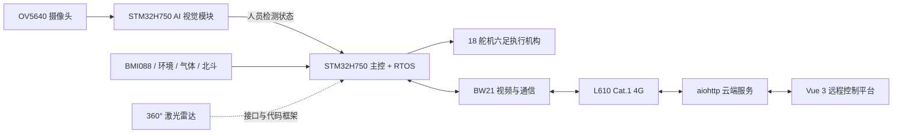

# 基于 STM32H750 的 AI 视觉六足救援机器人

面向建筑坍塌、地下管廊、矿井、野外搜救和危险巡检场景的六足机器人原型。系统采用“主控 + AI 视觉 + 4G 通信”分层架构，以 STM32H750、RTOS、OV5640、BMI088、BW21 和 L610 为核心，形成感知、决策、执行与远程通信闭环。


> 完整设计、硬件、软件和样机成果见 [《基于 STM32H750 的 AI 视觉六足救援机器人技术文档》](docs/基于STM32H750的AI视觉六足救援机器人技术文档.pdf)。

## 项目亮点

- **端侧 AI 人员检测**：OV5640 采集图像，STM32H750 通过 X-CUBE-AI 运行 NanoV4 96×96 INT8 模型，板端实测约 8 FPS。
- **六足运动控制**：18 舵机、逆运动学和多步态规划，配合 BMI088 与姿态滤波提高复杂地形稳定性。
- **环境与定位感知**：集成温湿度、气压、气体、人体感应和北斗/GPS 数据采集。
- **昼夜视觉切换**：BH1750 软件 I²C 光照检测、IR-cut 控制、夜间状态输出和 AI 人员检测 GPIO 输出。
- **4G 视频与遥控**：BW21 负责 H.264 视频编码与 USB CDC ECM 通信，L610 完成 4G 链路，云端提供视频、传感器、定位和控制服务。
- **远程控制平台**：aiohttp 后端 + Vue 3 前端，支持 WebSocket、MJPEG、地图、传感数据和键盘/面板控制。
- **失联保护**：通信固件在 500 ms 内未收到移动指令时自动发送停止指令。

## 系统架构



## 当前完成状态

| 模块 | 状态 | 说明 |
| --- | --- | --- |
| 六足机械与运动控制 | 已完成样机联调 | 支持基础行走、姿态感知和多步态控制 |
| AI 人员检测 | 已完成板端部署 | NanoV4 INT8，约 8 FPS，LCD 显示检测框与状态 |
| 昼夜视觉 | 已完成代码集成 | BH1750、IR-cut、夜间状态输出 |
| 环境与定位 | 已完成代码集成 | 温湿度、气压、气体、人体感应、北斗/GPS |
| 视频与远程控制 | 已完成链路与平台 | BW21 + L610、视频/状态回传、控制指令下发 |
| 激光雷达避障 | 待实机联调 | 已保留接口、任务和避障代码框架，不作为已验证功能 |

## 主要性能

| 指标 | 参数 |
| --- | --- |
| 最大行进速度 | 约 1.1 m/s（三角步态） |
| 最大爬坡角度 | 约 30° |
| 姿态感知 | BMI088 + 卡尔曼/四元数 EKF |
| AI 推理速度 | 板端实测约 8 FPS |
| AI 输入 | `int8(1×96×96×3)` |
| AI 输出 | `int8(1×24×24×5)`，person 单类别 |
| 模型权重 | 约 48.38 KiB |
| 激活 RAM | 约 87.43 KiB |
| 计算量 | 约 14.54 MMACC |
| 通信方式 | BW21 + L610 Cat.1 4G |

## 仓库结构

```text
.
├─ Core/、Drivers/、Middlewares/       STM32H750 AI 视觉固件
├─ X-CUBE-AI/、models/                 生成网络代码与 NanoV4 模型
├─ MDK-ARM/shiyan002.uvprojx           AI 视觉 Keil 工程
├─ shiyan002.ioc                       AI 视觉 CubeMX 配置
├─ H7_onboard/                         六足机器人主控固件
│  ├─ MDK-ARM/Hexapod.uvprojx          主控 Keil 工程
│  ├─ MDK-ARM/USER/                    步态、舵机、姿态、传感器与任务代码
│  └─ hexapod.ioc                      主控 CubeMX 配置
├─ communication/
│  ├─ 固件/bw21_l610_ecm.c             BW21 + L610 通信固件
│  ├─ 服务器端/                         aiohttp、UDP/TCP、WebSocket、MJPEG
│  └─ 前端/                             Vue 3 远程控制平台
├─ tests/、tools/                      AI 后处理测试与辅助工具
└─ docs/                               技术文档与样机图片
```

主控工程仅保留编译所需的 CMSIS/HAL、FreeRTOS、DSP 库和项目源码，未纳入 Keil 中间文件、对象文件及个人 IDE 状态。

## AI 视觉固件

### 模型与处理流程

1. OV5640 通过 DCMI + DMA 连续采集 RGB565 图像。
2. LCD 通过 SPI6 显示实时画面、FPS、AI 状态和检测框。
3. 当前画面经中心裁剪与缩放后转换为 96×96 RGB888 INT8 输入。
4. X-CUBE-AI 执行 NanoV4 推理。
5. Anchor-free / FCOS 风格后处理执行质量分数计算、LTRB 解码、局部极大值筛选和 NMS。
6. 检测结果通过 LCD 与 `AI_PERSON` GPIO 输出；BH1750 根据环境光切换 IR-cut 和夜间状态输出。

模型和生成报告位于：

- `models/nanov4_96_full_int8.tflite`
- `models/nanov4_96.onnx`
- `X-CUBE-AI/App/network_generate_report.txt`
- `Core/User/Src/nanov4_postprocess.c`

### 编译

1. 使用 Keil MDK-ARM 打开 `MDK-ARM/shiyan002.uvprojx`。
2. 选择目标 `shiyan002`。
3. Rebuild 后通过 J-Link 或 ST-Link 下载。
4. 复位运行，LCD 应显示摄像头画面、FPS、`AI_OK` 和检测结果。

具体引脚、时钟、DMA 和中断配置以 `shiyan002.ioc` 为准。修改 CubeMX 配置并重新生成后，需要确认 `Core/User` 仍包含在 Keil 工程中。

## 六足主控固件

主控工程基于 STM32H750VBTx 与 FreeRTOS，核心代码位于 `H7_onboard/MDK-ARM/USER/`：

- `TASK/`：步态控制、姿态、传感器、云端、PS2、LED 和雷达任务。
- `APP/`：腿部逆解、舵机、步态、SC16IS752、AHT20、BMP280、气体、GPS、PIR 和 D6 雷达驱动。
- `IMU/`：BMI088、卡尔曼滤波、四元数 EKF、PID 和 EEPROM 校准数据。

编译步骤：

1. 使用 Keil MDK-ARM 打开 `H7_onboard/MDK-ARM/Hexapod.uvprojx`。
2. 选择目标 `hexapod`。
3. 按实际硬件校对 `H7_onboard/hexapod.ioc`、串口、舵机方向和传感器接线。
4. Rebuild 并下载到主控板。

## 通信与远程平台

### 服务端

服务端默认监听以下端口：

| 端口 | 用途 |
| --- | --- |
| `8765` | HTTP、WebSocket、MJPEG |
| `9091/UDP` | H.264 视频流 |
| `9092/TCP` | 4G/L610 H.264 兼容接收 |
| `9093/UDP` | 传感器、GPS 与控制指令 |

启动前必须配置管理员口令：

```bash
cd communication/服务器端
python -m pip install -r requirements.txt
export ROBOT_ADMIN_USER=admin
export ROBOT_ADMIN_PASSWORD='replace-with-a-strong-password'
python server.py
```

Windows PowerShell 使用 `$env:ROBOT_ADMIN_USER` 和 `$env:ROBOT_ADMIN_PASSWORD` 设置同名环境变量。安装 `ffmpeg` 后可启用 H.264 到 MJPEG 的降级转码端点。

### 前端

```bash
cd communication/前端
npm install
npm run dev
# 生产构建
npm run build
```

部署前修改 `communication/前端/src/config/config.js` 中的服务端地址。登录口令只发送到服务端验证，不在前端源码中保存。

### BW21 + L610 固件

固件入口为 `communication/固件/bw21_l610_ecm.c`，使用 BW21 USB Host 连接 L610 ECM 网络接口，并完成：

- GC2053 H.264 硬件编码与视频发送；
- STM32 UART 传感器/GPS 数据解析与 JSON 封装；
- 云端控制指令转发为 `F/B/L/R/S` 单字符命令；
- 500 ms 控制超时自动停止。

烧录前需要按部署环境修改服务器 IP、L610 ECM 地址和网络参数。

## 部署与安全提示

- 当前通信配置中包含项目联调服务器地址，公开部署前应替换为自己的域名或地址。
- 公网部署必须配置强口令，并建议增加 HTTPS/WSS、反向代理、访问控制和令牌校验。
- D-Cache 会影响 DCMI DMA 帧缓冲一致性，修改采集链路时需同步检查 cache clean/invalidate。
- 舵机动力、主控逻辑和通信视觉模块应分区供电并共地，避免舵机大电流干扰。
- 激光雷达目前仅完成接口与代码框架，接入实物后仍需完成数据校验和闭环避障测试。

## 许可说明

仓库包含 STM32 HAL/CMSIS、FreeRTOS、X-CUBE-AI 生成代码及相关运行库。第三方组件分别受其原始许可约束；使用 X-CUBE-AI 内容前请阅读 `LICENSE_X-CUBE-AI.txt`。
